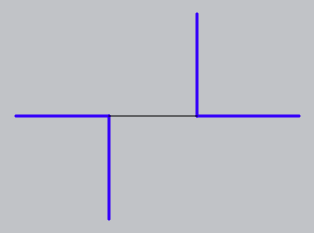
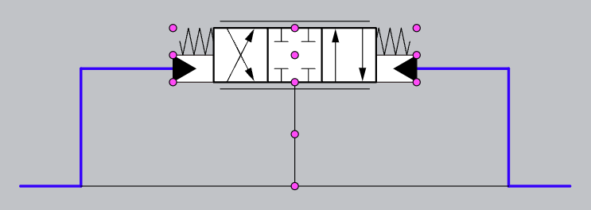

# What is this?

This app is an editor for electrical & hydraulic circuit diagrams.

Some basic features are still missing, so it is not yet "production ready".

# User guide

This user guide may not be up-to-date. However, it is/was accurate at the time of writing.

## Opening a project

The app facilitates the drawing of circuit diagrams that contain arbitrary symbols and line segments. Therefore, these resources must be provided to the app before drawing can begin. The app is currently centered around a "project folder", which must contain a subfolder for each kind of resource:

-  The "symbols" folder holds the SVG files for each kind of circuit symbol that the user wishes to place. For example, the user may wish to place electrical resistors or hydraulic valves.
-  The "lines" folder holds the JSON files for each kind of line that the user wishes to draw with. For example, the user may wish to draw electrical wires or hydraulic lines.
-  The "vertex glyphs" folder holds the SVG files for each kind of glyph that can appear at the endpoints of lines, or at the ports of symbols. For example, perhaps a circular "node" should appear at a T-intersection of fluid lines.
-  The "crossing glyphs" folder holds the SVG files for each kind of glyph that can appear at the point where two lines cross without intersecting. For example, perhaps a "hop-over" should appear at the point where two hydraulic lines cross.

To prepare the app for drawing, click on the "choose a project folder" button in the sidebar, and select a folder containing each of the subfolders listed above. The resources within those subfolders will be loaded into the app.

The symbols that have been loaded will appear in the sidebar. To place a symbol on the canvas, drag it out of the sidebar.

## Using the tools

There are currently six tools implemented: draw, erase, warp, slide, amass, and freeze.

A tool can be equipped by pressing its button in the GUI, or by using a keyboard shortcut.

The keyboard shortcuts are:

-  `D`: draw
-  `E`: erase
-  `W`: warp
-  `S`: slide
-  `A`: amass
-  `F`: freeze

It is also possible to switch to another tool _temporarily_. To do so, hold down the key of the desired tool and perform the operations you desire. When the key is released, the editor will automatically switch back to the previous tool.

### The draw tool

The draw tool allows you to draw line segments, and attach them to symbols. To draw a line segment, first select the line type in the sidebar that you would like to draw. Then, click and drag upon the canvas in the direction you would like to draw.

By default, only horizontal and vertical lines can be drawn. To draw in a different direction, hold the Shift key. Once you have chosen a new draw direction, the Shift key can be released.

While drawing, the endpoint of the line being drawn will snap towards other line segments, and to the ports of nearby symbols. If the mouse is released while this is happening, the line will attach itself to the target. To _detach_ a line from a target, click at the attachment point and drag backward along the line, as if you were "unplugging" it.

To draw multiple line segments in quick succession, you can tap the draw key ("D") to finalize the current line segment and begin the next.

### The erase tool

The erase tool allows you to erase objects, as you would expect. To erase a single object, click on it. To erase many objects at once, click and drag. All objects within the rectangular drag region will be deleted.

### The warp tool

The warp tool allows you to move and rotate an object (or a selection of objects) "freely", meaning the object will not collide with surrounding objects.

If the Shift key is held, the object will be rotated. Otherwise, it will be translated.

By default, rotation will snap towards "nice" orientations for the object, e.g. horizontal and vertical. In addition, if the object being warped has line segments attached to it, then the movement will snap toward "nice" orientations for those line segments. This snapping behaviour can be disabled, as explained later in this guide.

### The slide tool

The slide tool allows you to move an object (or a selection of objects) while ensuring it remains a "standard distance" apart from other objects on the canvas. Roughly, the slide tool "pushes" objects, without letting them touch or pass one another.

By default, the moved object(s) will push all objects in their path. However, if the Shift key is held, only objects that are connected via a line segment will be pushed.

A slide operation occurs along a particular axis. For the most part, an object can only be slid along an axes shared by one or more line segment(s) it is attached to. As the object is slid, those line segments will then stretch and/or shrink.

### The amass tool

The amass tool allow you to select (i.e. _amass_) multiple circuit elements, for the purpose of applying operations to them simultaneously. Amassed items are indicated by a bright glow/outline.

The amass tool has similar controls to the "select" and/or "move" tools of popular CAD apps. To amass a single item, click on it. To amass a rectangular region of items, click on an empty part of the canvas and then drag to specify the region.

By default, the previous amassment will be cleared each time you amass new items. If you instead wish to _add_ to the current amassment, hold Shift before beginning the operation. (An exception: Shift-clicking on a single item will _toggle_ it, rather than add it.) If you wish to _remove_ from the current amassment, hold Alt/Opt before beginning the operation. To _clear_ the current amassment, click on an empty part of the canvas.

Items remained amassed even after changing to another tool. This gives you the opportunity to manipulate the amassment using multiple tools (such as _warp_ and _slide_) without having to re-select the items after each tool change.

When using one of the movement tools to manipulate the circuit diagram, the amassment—if it exists—moves _rigidly_. In other words, if the movement operation causes an amassed item to move, then _all other_ amassed items will move by exactly the same amount. You may find this behaviour helpful in the following scenarios:

-  You want to move the amassment as a single unit.
-  You want to move _other_ parts of the circuit, and you want to keep the amassment undisturbed.

### The freeze tool

The freeze tool allows you to make line segments _rigid_, meaning their length cannot be changed by subsequent warping and sliding.

The controls for freezing are identical to those for amassing, with the exception that the Shift key is "stuck on" by default. This is because freezing is intended to be more-or-less permanent — freezing a segment signals that its length is "finalized" and needs to be preserved. Just like with the amass tool, segments can be bulk-unfrozen by holding Alt/Opt and dragging.

## Configuring snapping behaviour

To aid you in creating clean and precise diagrams, many operations will snap the objects being manipulated toward a standard angle and/or distance apart. This behaviour can be customized or disabled by toggling the respective icons in the sidebar.

## Navigating the canvas

### Using a mouse

To pan the canvas using a mouse, hold down the middle mouse button and then move the mouse in the direction you want to pan.

To zoom the canvas using a mouse, place the mouse cursor at the location you wish to zoom toward, and then rotate the scroll wheel.

### Using a trackpad

If you are using a trackpad, you can pan the canvas by performing a panning gesture (e.g. two-finger swipe), and zoom the canvas by performing a zooming gesture (e.g. pinch-to-zoom).

### Using the keyboard

Panning can also be performed by holding the spacebar and then moving the mouse cursor in the direction you want to pan.

### Resetting the camera

Double-tapping the spacebar will move the camera back to the center of the diagram. You will find this useful if you accidentally pan away from the diagram and cannot find it again.

## Resource file formats

This section describes the file format of each type of resource (e.g. symbols, line types) that can be used to draw circuit diagrams. To use these resources within a project, they must be placed in their appropriate places in the project folder, as described earlier.

### Symbols

The circuit symbols you place in your project folder must be valid SVG files. When a symbol is loaded, the editor looks in the file for the following information about it:

-  The view box.
   -  This determines the region that can be interacted with using the mouse.
-  The collision box.
   -  This determines how the symbol should snap to other objects.
-  The location of ports.
   -  Ports are the parts of a symbol that circuit lines are able to connect to.

The view box of a symbol is automatically configured by the CAD app from which the SVG was exported (e.g. Adobe Illustrator). Typically, the view box corresponds to a "canvas" or an "artboard" within the CAD app.

A collision box can be specified by assigning the ID "collisionBox" to any SVG element. Currently, only rectangular collision boxes are supported. If you specify a non-rectangular shape, it will be approximated by a rectangle. If no collision box is specified, the view box will be used instead.

A port can be specified by assigning an ID containing the letters "snap" to any SVG element (e.g. "snap1" or "theSnapPoint"). The center of such an element will be treated as the port's location. If you do not wish for the port to have a visual appearance, you can make it invisible or transparent.

To assign IDs to SVG elements, you do not need to manually edit your SVG files. Instead, in most CAD apps, when you assign a name to a graphical object (e.g. an ellipse), the corresponding element in the exported SVG will inherit that name as its ID. Therefore, specifying a collision box should be as easy as drawing a rectangle in your CAD app and naming it "collisionBox", and specifying a port should be as easy as drawing an ellipse and using the word "snap" in its name.

### Line types

The circuit editor allows you to define and draw lines of (almost) arbitrary appearance. Each line type is defined by a JSON file with a particular format. The root object of the JSON file can contain the following fields:

-  color (mandatory): The color of the line, given as a CSS color, e.g. "blue", "#FFFFFF", or "rgb(180, 0, 90)".
-  thickness (mandatory): The thickness of the line in pixels, given as an integer, e.g. 3.
-  dasharray (optional): The dash pattern of the line, given in [the standard format](https://developer.mozilla.org/en-US/docs/Web/SVG/Attribute/stroke-dasharray) for SVG dash patterns.
-  meeting (optional): A JSON object describing what glyphs (if any) should appear when this line type meets other line types. The format of this object is described in more detail below.

As an example, you may define a JSON file "drain.json" for a drain line, containing the following:

```
{
   "color": "#0000FF",
   "thickness": 3,
   "dasharray": "6 6",
   "meeting": {
      "drain": {
         "crossing": "hopover.svg",
         "T": "node.svg",
         "X": "node.svg"
      },
      "manifold": {
         "crossing": "port.svg",
         "T": "plug.svg",
         "X": "port.svg",
         "attaches": true,
      }
   }
}
```

This file describes a blue line (#0000FF) with a thickness of 3, and a basic dash pattern. The "meeting" field contains two entries. The first describes the glyphs that should be drawn when a drain line meets another drain line, and the second describes the glyphs that should be drawn when a drain line meets a manifold line.

The "meeting" object consists of a set of key-value pairs. The keys ("drain" and "manifold") must match the file names of other line-type JSON files in the project, excluding their file extension. Thus for our example, the files "drain.json" and "manifold.json" must be included in the same directory as our example file (which happens to be "drain.json" itself).

Each key is paired with a JSON object, which may contain the following fields. Herein, "file-segment" refers to a line segment of the type being specified in the current JSON file, and "key-segment" refers to a line segment of the type being referenced in the current key-value pair:

-  crossing (optional): The glyph that should be drawn when a file-segment crosses over a key-segment without intersecting it. (This field is typically used to specify a "hop-over" glyph.)
-  L (optional): The glyph that should be drawn when a file-segment intersects a key-segment at an L-junction, i.e. a corner.
-  T (optional): The glyph that should be drawn when a file-segment intersects a key-segment at a T-junction.
   -  Here, the file-segment is the stem of the T, and the key-segment is the crossbar of the T. If you wish to specify the opposite kind of T-junction, you must do so in the key-segment's JSON file.
   -  T-junctions involving three line types are not supported.
-  X (optional): The glyph that should be drawn when a file-segment intersects a key-segment at an X-junction.
   -  An X-junction is any junction with four lines coming into it. Neither the angle of the lines, nor the multiplicity of each line type is relevant.
   -  X-junctions involving three or more line types are not supported.
-  attaches (optional): If set to `true`, the file-segment will "attach onto" the key-segment when intersecting it. If set to `false`, or omitted, the file-segment will _split_ the key-segment when intersecting it. For further explanation, see the "attachments" section of this user guide.

The particular glyph to be used at one of these meetings is described by a file name, as illustrated in the example. As described earlier in this guide, crossing glyphs (those associated with the "crossing" key) must be placed in the "crossing glyphs" folder, and vertex glyphs (those associated with the "L/T/X" keys) must be placed in the "vertex glyphs" folder. The format of these files is described in the next section.

Most meeting types can be specified in _either_ file of the line types involved. For example, the X-intersection between a "drain" line and a "manifold" line can be specified in either "drain.json" or "manifold.json". The glyph that will be drawn is determined as follows:

-  If a glyph is only specified in one file, then that glyph will be used.
-  If a glyph is specified in both files, and it is the same glyph, then that glyph will be used.
-  If a glyph is specified in both files, but they are different glyphs, then no glyph will be used.
-  If a glyph is specified in neither file, then no glyph will be used.

### Configuring line type display order and keyboard shortcuts

An optional `config.json` file can be placed in the same folder as the line types to configure two things:

-  The order in which the line types appear in the sidebar.
-  Keyboard shortcuts for switching to each line type.

Here is an example of what `config.json` might look like:

```
{
   "sidebarOrder": ["tether", "hydraulic", "drain", "pilot"],
   "keyBindings": {
      "tether": "T",
      "hydraulic": "1",
      "drain": "2",
      "pilot": "3"
   }
}
```

As before, a line type is referenced by its file name (omitting the `.json` file extension). A key binding can be specified by a letter A-Z, a number 0-9, or any of the codes on [this page](https://developer.mozilla.org/en-US/docs/Web/API/UI_Events/Keyboard_event_code_values).

### Glyphs

A "glyph" is a small symbol that can be placed (automatically or manually) at the point where two lines meet. As described earlier, a glyph is specified by an SVG file placed in a particular subfolder within the project folder.

There are two kinds of glyph:

-  Crossing glyphs, which appear at the points where two lines cross without intersecting.
-  Vertex glyphs, which appear at L-junctions, T-junctions, and X-junctions.

The file format for glyphs is the same as for symbols (described earlier), with the following caveats:

-  A crossing glyph splices itself into the middle of a line — typically, the line that is "hopping over". Thus it must be a symbol with two ports: one for each side of the cut.
-  A vertex glyph appears at the point where multiple lines intersect. Thus it must be a symbol with one port, corresponding to the part of the glyph that should be placed at the intersection point.

## Attachments

By default, when a line segment is connected to a point along another segment, the latter segment is split into two halves. You may decide that, for a particular pair of line types, this behaviour fails to respect the _meaning_ of the connection. For example: maybe you are trying to draw cables "plugging into" a device. Certainly, the cables should not cut the device in half!

The alternative to the aforementioned splitting is what I call "attaching". When a line segment "attaches" to another segment, the latter segment is _not_ split. This only makes a minor difference to diagram construction, but you may find it relevant.

For instructions on how to enable this behaviour, see the "line types" section of this user guide.

## Tethers

Tethers are a special line type that is built into the editor. They are unique in three ways:

-  They can be hidden via the config bar.
   -  If an export feature were to exist, they would also be omitted when the circuit is exported.
-  They _attach_ onto every other line type.
-  They come with a special attachment point at their midpoint. Other than this, nothing can split or attach onto a tether.

Tethers are intended to be used to enforce relative positioning of circuit elements. For example, two corners can be aligned vertically as follows:



And a symbol can be positioned midway between two lines as follows:



These pink dots are visible whenever the tether line type is selected. You can use them to align symbols and/or tethers. In this example, the bottom-midpoint of the symbol has been aligned with the midpoint of the horizontal tether by drawing a vertical tether between them. The horizontal tether will act as if it has been frozen using the Freeze tool for as long as the vertical tether remains attached to it. This ensures that the alignment is preserved throughout subsequent operations.

## Q&A

### How do I create a schematic with selectable variations / configurations?

Sometimes you'd like to be able to switch between a few different configurations of a schematic. For example, a mine truck might come with different options for dumping or ejecting the box, or a machine might have a few different pump options.

To draw these schematics, you'll need to split them into pieces. You'll have one drawing for the parts of the system that stay the same regardless of selected configuration, and a separate drawing for each of the variations. You'll combine these separate drawings when coding the simulation.

To make sure the lines coming out of the variations meet up with the lines of the static part of the system, you should create a symbol (probably in the same shape as the manifold, if any) with ports around the outside for each line. Place one copy of this symbol in the drawing for the static parts of the system, and another copy of the symbol in each of the variations. By snapping to the same ports from the "outside" and the "inside", you'll guarantee that everything lines up nicely.
